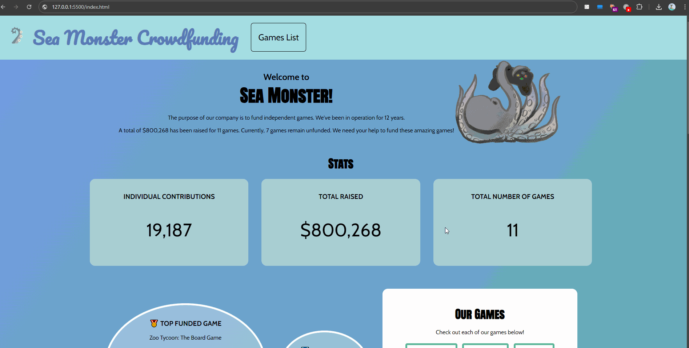

# WEB102 Prework - *Sea Monster Crowdfunding "Kraken Gaming"*

Submitted by: **Nimsy Corea**

**Sea Monster Crowdfunding "Kraken Gaming"** is a website for the company Sea Monster Crowdfunding that displays information about the games they have funded.

Time spent: **14** hours spent in total

## Required Features

The following **required** functionality is completed:

* [x] The introduction section explains the background of the company and how many games remain unfunded.
* [x] The Stats section includes information about the total contributions and dollars raised as well as the top two most funded games.
* [x] The Our Games section initially displays all games funded by Sea Monster Crowdfunding
* [x] The Our Games section has three buttons that allow the user to display only unfunded games, only funded games, or all games.

The following **optional** features are implemented:

* [x] The live search returns name games that match the search text.
* [x] The navigation bar has a link to the main games section.
* [x] The background was changed to be more pleasing.
* [x] The game filter buttons toggle between the different selections.
* [x] The aesthetics of the website were changed according to the theme, with original art included.
* [x] Game card shows funding progress for each game based on the pledges and the goal.

## Video Walkthrough

Here's a walkthrough of implemented features:

<!-- Replace this with whatever GIF tool you used! -->
GIF created with LiceCap.  
<!-- Recommended tools:
[Kap](https://getkap.co/) for macOS
[ScreenToGif](https://www.screentogif.com/) for Windows
[peek](https://github.com/phw/peek) for Linux. -->

## Notes

The challenges in this project came with using JavaScript and using CSS to get the visuals I wanted. JavaScript can manipulate element's HTML and their CSS, and getting familiar with which takes priority took some testing of the code. The JavaScript conflicted with CSS rules and it changed the appearance. What helped this issue was using the Inspect Element feature on the local web server to find where there were issues and in what element, this made troubleshooting a lot easier. 

My previous experience in CSS involved using Bootstrap, some aspects such as wrapping, margins, and padding, were slightly different syntax-wise to achieve. The framework combines a few CSS rules and focuses the styling to be mostly placed in the HTML file, based on my experience. I was, however, still able to achieve a responsive web design, which I tested using the Inspect Element Device Toolbar.

## License

    Copyright 2024 Nimsy Corea

    Licensed under the Apache License, Version 2.0 (the "License");
    you may not use this file except in compliance with the License.
    You may obtain a copy of the License at

        http://www.apache.org/licenses/LICENSE-2.0

    Unless required by applicable law or agreed to in writing, software
    distributed under the License is distributed on an "AS IS" BASIS,
    WITHOUT WARRANTIES OR CONDITIONS OF ANY KIND, either express or implied.
    See the License for the specific language governing permissions and
    limitations under the License.
